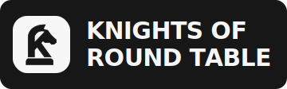

<div align="center">
  

  <h1>Knights of the Round Table</h1>

  <p>A hidden-CoT, multi-model expert panel for structured AI discussion.</p>

  <p>
    <a href="README.zh-CN.md">简体中文</a>
    ·
    <a href="#quick-start">Quick start</a>
    ·
    <a href="#api-surface">API</a>
    ·
    <a href="kort/docs/architecture-rules.md">Architecture rules</a>
  </p>

  <p>
    
    
    
    
  </p>
</div>

---

## What KORT Is

KORT routes a user's question to a configurable panel of AI agents:

1. Experts reason independently.
2. Critics review and challenge.
3. The graph may continue for multiple rounds.
4. A summarizer projects only user-visible stage summaries.
5. A synthesizer produces the final answer.

Product boundary: raw expert discussion, provider reasoning content, and internal transcripts stay inside backend runtime state. Users see only the summarizer's projections and the final answer.

## Highlights

| Area | Current capability |
| --- | --- |
| Chat UX | ChatGPT-like shell with sidebar history, fixed composer, streamed answer output, Markdown/KaTeX |
| Thinking UX | Collapsed thinking entry, right-side drawer, completed state, structured summary nodes |
| Orchestration | LangGraph discussion flow with experts, critics, summarizer, synthesizer, configurable depth |
| Request routing | Simple prompts can skip full panel orchestration |
| Agents | File‑backed agents with role, prompt, provider profile, priority, Skill access |
| Providers | Runtime provider profiles, local key status, connectivity checks, OpenAI‑compatible calls |
| Persistence | Only visible projections are persisted; raw hidden discussion never exposed |

## Quick Start

```bash
docker compose up --build
```

Then open:

| Service | URL |
| --- | --- |
| Web app | <http://localhost:3000> |
| API | <http://localhost:8000> |
| Health check | <http://localhost:8000/health> |

## Local Development

### Backend

```bash
cd kort/apps/api
pip install -e ".[dev]"
python -m uvicorn kort_api.main:app --reload --port 8000
```

Optional `.env`:

```env
RUNTIME_ROOT=../../runtime
DATA_ROOT=../../runtime/data
PROVIDERS_FILE=../../runtime/providers/profiles.json
CONVERSATION_DB=../../runtime/data/conversations.json
```

### Frontend

```bash
cd kort/apps/web
pnpm install
pnpm dev
```

The web app expects `NEXT_PUBLIC_API_BASE_URL` to point at the backend. Docker Compose sets it to `http://localhost:8000`.

## Project Layout

```text
kort/
├── apps/
│   ├── api/                    # FastAPI backend
│   │   └── src/kort_api/
│   │       ├── app.py          # API routes
│   │       ├── agents.py       # Agent loader and CRUD
│   │       ├── conversations.py # Visible conversation store and SSE service
│   │       ├── model_client.py # OpenAI-compatible model client
│   │       ├── orchestration.py # LangGraph runtime
│   │       ├── providers.py    # Provider profiles and local secrets
│   │       ├── request_router.py
│   │       └── schemas.py      # Pydantic contracts
│   └── web/                    # Next.js 15 frontend
│       └── app/
│           ├── page.tsx        # Chat shell, sidebar, settings, drawer
│           ├── locale.ts
│           └── globals.css
├── runtime/
│   ├── agents/                 # Agent folders and agent.yaml files
│   ├── providers/              # Provider metadata
│   ├── skills/                 # Global Skills
│   └── data/                   # Local runtime data
└── docs/
    └── architecture-rules.md
```

## Architecture

```text
User question
  -> request router
  -> direct answer | solo thinking | expert panel
  -> LangGraph expert / critic rounds
  -> summarizer visible projection
  -> synthesizer final answer
  -> streamed UI response
```

Core rules:

- Hidden CoT is never shown to the user.
- Users see only summarizer stage summaries and the final answer.
- Product code lives under `kort/apps`, runtime data under `kort/runtime`.
- API keys are stored locally in runtime data or environment variables, never committed.
- All API payloads are validated with Pydantic.

See [architecture-rules.md](kort/docs/architecture-rules.md).

## API Surface

### Providers

| Method | Path | Purpose |
| --- | --- | --- |
| `GET` | `/api/providers` | List provider profiles |
| `PUT` | `/api/providers/{provider_id}` | Create or update a provider profile |
| `POST` | `/api/providers/{provider_id}/test` | Validate profile and key status |
| `GET` | `/api/provider-secrets` | Return key configured status |
| `PUT` | `/api/providers/{provider_id}/secret` | Save a local runtime API key |

### Agents

| Method | Path | Purpose |
| --- | --- | --- |
| `GET` | `/api/agents` | List agents |
| `POST` | `/api/agents` | Create an agent |
| `PUT` | `/api/agents/{name}` | Update an agent |
| `DELETE` | `/api/agents/{name}` | Delete an agent |
| `GET` | `/api/skills` | List global Skills |

Agent folders live at `kort/runtime/agents/{name}/agent.yaml`:

```yaml
name: research-lead
nickname: Research Lead
role: expert
provider_profile: deepseek
model: deepseek-chat
system_prompt: |
  You are the lead research expert...
allowed_global_skills:
  - structured-analysis
  - evidence-grounding
disabled_global_skills:
  - stage-summary-projection
priority: 20
```

Read [How To Make A Agent](kort/runtime/agents/How%20To%20Make%20A%20Agent.md) for the file protocol.

### Conversations

| Method | Path | Purpose |
| --- | --- | --- |
| `GET` | `/api/conversations` | List visible conversation records |
| `GET` | `/api/conversations/{conversation_id}` | Load one persisted conversation |
| `GET` | `/api/conversations/{conversation_id}/stream` | Reattach to a running conversation stream |
| `PATCH` | `/api/conversations/{conversation_id}` | Rename a conversation |
| `DELETE` | `/api/conversations/{conversation_id}` | Delete a conversation |
| `POST` | `/api/conversations/stream` | Start or continue an SSE conversation |

Request example:

```json
{
  "question": "What is quantum entanglement?",
  "level": "auto",
  "conversation_id": null,
  "deep_think": false
}
```

## Built-in Agents

| Agent | Role | Default model |
| --- | --- | --- |
| `research-lead` | expert | `deepseek-chat` |
| `creative-thinker` | expert | `deepseek-chat` |
| `logician-main` | expert | `deepseek-chat` |
| `critic-main` | critic | `deepseek-chat` |
| `summarizer-main` | summarizer | `deepseek-chat` |
| `synthesizer-main` | synthesizer | `deepseek-chat` |

System agents are protected from GUI deletion or editing.

## Built-in Skills

| Skill | Purpose |
| --- | --- |
| `structured-analysis` | Structured reasoning framework |
| `evidence-grounding` | Evidence and citation discipline |
| `gap-analysis` | Missing‑information detection |
| `hidden-cot-guard` | Hidden‑CoT boundary guard |
| `stage-summary-projection` | User‑visible stage summary format |
| `final-answer-structure` | Final answer structure template |

Global Skills are shared. Private agent Skills can be added under `kort/runtime/agents/{name}/skills/` and are managed through the filesystem.

## Tech Stack

| Layer | Stack |
| --- | --- |
| Backend | Python 3.12, FastAPI, Uvicorn |
| Orchestration | LangGraph |
| Current model client | OpenAI‑compatible HTTP client |
| Planned provider unification | LiteLLM |
| Validation | Pydantic v2 |
| Frontend | Next.js 15, React 19, Tailwind CSS 3 |
| Rendering | react-markdown, KaTeX |
| Deployment | Docker Compose |

## Verification

```bash
cd kort/apps/api
python -m pytest tests
```

```bash
pnpm --dir kort/apps/web exec tsc --noEmit
pnpm --dir kort/apps/web build
```
